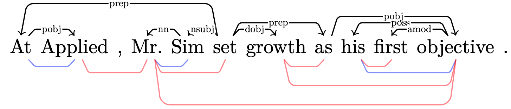

# PMI dependencies from contextual embeddings

Data from [PTB](https://catalog.ldc.upenn.edu/LDC99T42) (corpus annotated as [Stanford dependencies](https://nlp.stanford.edu/software/dependencies_manual.pdf)).


## Accuracy of PMI dependencies

running [main.py](pmi-accuracy/main.py) gets PMI-based dependencies for sentences in PTB, using a language model to get PMI estimates, extracts a tree, calculates undirected attachment score, reports the results.

- [langaugemodel.py](pmi-accuracy/langaugemodel.py) has a class for each of the language models we're using, with method to get a PMI matrix from a sentence (that is, from a list of Penn Treebank tokens).
- [parser.py](pmi-accuracy/parser.py) has the methods to get either a simple MST (Prim's algorithm) or a projective MST (Eisner's algorithm) from the PMI matrices.
- [task.py](pmi-accuracy/task.py) has stuff for dealing with the raw PTB and getting a distance matrix (.conllx file -> torch tensor), to extract parse distance matrix, or linear string-distance matrix.

[print_tikz.py](pmi-accuracy/print_tikz.py) prints dependency trees with TikZ.

### The models we're testing

- XLNet
  - [xlnet-base-cased](https://huggingface.co/xlnet-base-cased)
  - [xlnet-large-cased](https://huggingface.co/xlnet-large-cased)
- BERT
  - [bert-base-cased](https://huggingface.co/bert-base-cased)
  - [bert-base-uncased](https://huggingface.co/bert-base-uncased)
  - [bert-large-cased](https://huggingface.co/bert-large-cased)
  - [bert-large-uncased](https://huggingface.co/bert-large-uncased)
- XLM
  - [xlm-mlm-en-2048](https://huggingface.co/xlm-mlm-en-2048)
- BART
  - [bart-large](https://huggingface.co/facebook/bart-large)
- DistilBERT
  - [distilbert-base-cased](https://huggingface.co/distilbert-base-cased)
- GPT2 (small) (not bidirectional...)
  - [gpt2](https://huggingface.co/gpt2)

TODO:

- ELMo
- Models explicitly modelling linguistic structure, like
  - ordered neuron LSTM,
  - recursive neural network grammars


### Penn Treebank data:

*Data used here is the 1700 sentences of the standard dev split, from partition 22 (in CONLL format, 40117 word-level tokens).*
[According to a standard partitioning: 02-21 for train (39832 sentences), 01,22,24 for dev, 23 for test (2416 sentences)]

### Baselines

The matched-length baseline/control is computed in [lengthmatch_baseline.ipynb](lengthmatch_baseline.ipynb).

Two other simple baseline classes are defined in [task.py](pmi-accuracy/task.py).

- `LinearBaselineTask`: makes a matrix whose entries are simply word-to-word distance in the string.  Recovering an min spanning tree from this matrix will give a relatively strong baseline.

- `RandomBaselineTask`: just makes a random matrix for the observation.  We can use this for projective and nonprojective random baselines (using the projective and nonprojective parsers in [parser.py](pmi-accuracy/parser.py)).

## Running

Minimal setup is something like the following (depending on the version of cuda). This is what I did on the Azure machine:
```bash
conda create -n pmienv python=3.7
conda activate pmienv
conda install numpy pandas tqdm transformers
conda install pytorch torchvision cudatoolkit=9.2 -c pytorch
pip install transformers
pip install sentencepiece # install sentencepiece tokenizer for xlnet
```

With `pmienv` active, to run:

```bash
python pmi-accuracy/main.py > out
```
<!--
or something more specific like:
```bash
nohup python pmi-accuracy/main.py --long_enough 30 --batch_size 32 --n_observations 100 > out 2> err &
```
-->

CLI options:

- `--n_observations`: (int, or string `all`). Set to calcuate UUAS for only the first _n_ sentences (default=`all` will do all sentences in the file specified at `conllx_file`).
- `--model_spec`: the transformers model spec string for which tokenizer, model, and pretrained weights to use: specify `xlnet-base-cased`, `xlnet-large-cased`, `bert-base-cased`, `bert-large-cased`, `bert-base-uncased`, `bert-large-uncased` or `xlm-mlm-en-2048`, or a path to pretrained model and config (see below) (default=`xlnet-base-cased`)
- `--offline_mode`: option for running on Compute Canada cluster. Will switch to `pytorch-transformers` and use offline model and tokenizer to be specified at `--xlnet_spec` in this case.
- `--connlx_file`: the path to a dependency file (in [CONLL-X format](https://ilk.uvt.nl/~emarsi/download/pubs/14964.pdf), such as generated by stanford CoreNLP's `trees.EnglishGrammaticalStructure`. See (convert_splits_to_depparse.sh)[scripts/convert_splits_to_depparse.sh]). (default=`ptb3-wsj-data/ptb3-wsj-test.conllx`),
- `--results_dir`: the root folder for results to be generated. A run of the script will generate a timestamped subfolder with results within this directory (default=`results/`)
- `--batch_size`: (int) size of batch dimension of input to xlnet (default 64).
- `--pad`: (int) default=0. Since these models do worse on short sentences (espeially XLNet), sentences in the PTB which are less than `pad` words long will be padded with context up until they achieve this threshold.  Predictions are still made only on the sentence in question, but running the model on longer inputs does slow the testing down somewhat, and you may need to lower `batch_size` in order to keep from running out of cuda RAM.
- `--save_matrices`: (boolean) set to save pmi matrices to disk

### Output

Two datasets as output:

- `scores` (sentence level data),
- `wordpairs` (word-pair level data within sentences).

In each of these, the column `sentence_index` refers to the same sentence in the input dataset.

## Notes

When writing `wordpairs.csv`, sentences with only one word (excluding ignored punctuation) are not reported.  When reporting `scores.csv` these sentences will have NaN values.  Hopefully this shouldn't cause problems.

### Tokenization
Tokenization is a little bit of an issue, since XLNet is trained on text which is tokenized on the subword level (by Google's [sentencepiece](https://github.com/google/sentencepiece)).  The PTB is tokenized already (_not_ at the subword level), and in order to use the gold parses from the PTB, subword tokenization must be ignored (we're not going to get an accuracy score for dependencies at the level of morphology).

What XLNet expects: tokenized input, according to the sentencepiece format, where `▁` (U+2581, "LOWER ONE EIGHTH BLOCK") corresponds to whitespace.

<!-- A hack method:
- transform plaintext version of PTB sentences (tokens delineated with spaces) into fake sentencepiece tokenized text, that is, prefixing most PTB tokens with a `▁`.
- use the result as input to XLNet.  This results in a good number of words mapped to id=0 (= `<unk>`) when these tokens are fed into `XLNetTokenizer.convert_tokens_to_ids()`, which might be a problem.
 -->
So I did the following:
- Use sentencepiece tokenizer, just use l-to-r linear chain rule decomposition within words to build up PTB tokens from these smaller subword tokens.  Get PMI between spans of subword tokens corresponding to PTB tokens.  


### Reporting

The results will be reported in a timestamped folder in the `/results` dir (or other if specified) like:
```
{results_dir}/xlnet-base-cased_{n_observations}_{date}/
| info.txt
| scores{...}.csv
| wordpairs{...}.csv
| (pmi_matrices.npz)
| (pseudo_logliks.npz)
```
- `spec.txt` - echo of CLI arguments, and also mean uuas scores, for reference and convenience.
- `scores.csv` - one row per sentence, reporting the sentence length, uuas with the four different ways of symmetrizing, and baseline uuas.
- `wordpairs.csv` - one row per pair of words in sentence (unordered), with various possible predictors including PMI scores.
- `pmi_matrices.npz` - (generated with the cli option `--save_npz`) an .npz archive of a collections.OrderedDict of calculated CPMI matrices as numpy arrays, with the space delimited sentence as the key.
- `pseudo_logliks.npz` - (generated with the cli option `--save_npz`) an .npz archive of a collections.OrderedDict of calculated pseudo-loglikelihoods, with the space delimited sentence as the key.

### Plotting dependencies in Ti*k*Z

Plotting pmi dependencies vs gold is useful... maybe.  To look at some plots, use [print_tikz.py](pmi-accuracy/print_tikz.py).  For instance, to look at sentences 1696, run:

```bash
python pmi-accuracy/print_tikz.py --sentence_indices 1696 --input_file path/to/scores*.csv
```

This will output a LaTeX file `dependencies.tex` into the results directory where the scores are.

Example:

- BERT


- DisitilBERT



- Word2Vec


- `--edge_type` you can specify projective or non projective edges, or symmetrize method tril, triu, sum, none like: `--edge_type nonproj.edges.tril`, for instance.  Default is `projective.edges.sum`.
- optionally, specify multiple sentence indices to plot multiple sentences at a time, and/or specify multiple edge types likewise.
- see `-h` for more

### Saving CPMI matrices

With the cli option `--save_npz`, PMI matrices are saved to a file 'pmi_matrices.npz' in the results dir.  These can be read back in afterward like this:

```python
npzfile = np.load(RESULTS_DIR + 'pmi_matrices.npz')
print(npzfile.files)
matrix_0 = npzfile[npzfile.files[0]]
```

### Loading CPMI matrices and scoring from them

Load saved matrices by specifying  `--model_spec load_npz` instead of a language model. Specify the directory containing `pmi_matrices.npz` and `pseudo_logliks.npz` with `--model_path`. This will create a new results directory with the calculated scores.  

Example: after saving matrices and (pseudo log-liklihoods) to disk in directory `results/bert-base-cased_pad10`, by running

```bash
python pmi-accuracy/main.py --model_spec bert-base-cased --save_matrices --pad 10
```

you can score these again (perhaps just to try out the option `--absolute_value`, say), with

```bash
python pmi-accuracy/main.py --model_spec load_npz --model_path results/bert-base-cased_pad10 --absolute_value
```

### Notes:

a messy scratch notebook is [here](https://colab.research.google.com/drive/1kJdXQpXhNbTqqdLatH_qfJCeuRD_9ggW#scrollTo=vCfdPAT2QNXd)
a minimal example notebook from a few iterations ago [here](https://colab.research.google.com/drive/1VVcYrRLOUizEbvKvD5_zERHJQLqB_gu4)

scratch for tokenization and models: [here](https://colab.research.google.com/drive/1NjUNw_1DRaejyLtuqq52l6sHEkJ9M-3E)

Some prose is there about the dealing with the fact that these estimates of PMI are non-symmetric, subword tokenization, etc.


--------------------------------------------------

# CPMI Results

See [results-clean/README.md](results-clean/README.md).

--------------------------------------------------

# Linear probe for POS embeddings

[linear-probe.py](pmi-accuracy/linear-probe.py) trains a single-layer linear network to extract POS embeddings from pretrained contextual embeddings.
This linear probe is a `d`-by-`h`-matrix, where input dimension `h` is the contextual embedding network's hidden layer dimension, and output dimension `d` is size of the POS tagset. Interpreting the output as an unnormalized probability distribution over POS tags, it is trained to minimize the cross-entropy loss between the predicted and observed POS, using the Penn Treebank (standard training split being partitions 02-21, with partitions 01,22,24 for validation).

Currently the probe achieves the following validation accuracy:

| model             | accuracy |
| ------------------|----------|
|`bert-base-cased`  | 97.50 %  |
|`bert-large-cased` | 93.52 %  |

## Using the POS-embeddings to get a POS-CPMI score

Running a contextual embedding model with the pretrained probe on top, we get estimates for the probability of the observed POS tags in the PTB.

<!--
### CACHED Dec 2019 version: no batches
File cached as [pmi-accuracy_nobatch.py](pmi-accuracy/old.pmi-accuracy_nobatch.py) gets pmi dependencies and calculates undirected attachment score, without using batches. Run:
```bash
python pmi-accuracy/old.pmi-accuracy_nobatch.py > out.txt
```
To get the accuracy score for each of the first few (default 20) sentences in the file (default `ptb3-wsj-data/ptb3-wsj-test.conllx`).  CLI options:

- `--n_observations`: the number n of sentences to use. It will calcuate UUAS for the first n sentences (default=`20`).
- `--xlnet-spec`: the XLNet pretrained weights to use: specify `xlnet-base-cased` or `xlnet-large-cased`, or a path to pretrained model and config (see below) (default=`xlnet-base-cased`)
- `--connlx-file`: the path to a dependency file (in [CONLL-X format](https://ilk.uvt.nl/~emarsi/download/pubs/14964.pdf), such as generated by stanford CoreNLP's `trees.EnglishGrammaticalStructure`. See (convert_splits_to_depparse.sh)[scripts/convert_splits_to_depparse.sh]). (default=`ptb3-wsj-data/ptb3-wsj-test.conllx`),
- `--results-dir`: the root folder for results to be generated. A run of the script will generate a timestamped subfolder with results within this directory (default=`results/`)

#### Running this on the cluster
To run on computecanada cluster, which has `pytorch-transformers` (an earlier verion) installed in their wheel, we need to change the corresponding import statement.  This is done by setting the additional optional CLI

- `--offline-mode`

All this will do is change that import statement. But you will also need to specify a path to the pretrained model, since it won't be able to grab it from huggingface's [aws server](https://s3.amazonaws.com/models.huggingface.co/).  So, pre download `xlnet-base-cased-config.json` `xlnet-base-cased-pytorch_model.bin`, and `xlnet-base-cased-spiece.model`, and save them like so:

```bash
mkdir XLNet-base
cd XLNet-base
wget -O pytorch_model.bin https://s3.amazonaws.com/models.huggingface.co/bert/xlnet-base-cased-pytorch_model.bin
wget -O spiece.model https://s3.amazonaws.com/models.huggingface.co/bert/xlnet-base-cased-spiece.model
wget -O config.json https://s3.amazonaws.com/models.huggingface.co/bert/xlnet-base-cased-config.json

mkdir XLNet-large
cd XLNet-large
wget -O pytorch_model.bin https://s3.amazonaws.com/models.huggingface.co/bert/xlnet-large-cased-pytorch_model.bin
wget -O spiece.model https://s3.amazonaws.com/models.huggingface.co/bert/xlnet-large-cased-spiece.model
wget -O config.json https://s3.amazonaws.com/models.huggingface.co/bert/xlnet-large-cased-config.json
```

!Watch out. The pytorch_model.bin files... they're large files. Eg,

```
XLNet-large/
| config.json         699  
| pytorch_model.bin  1,4G  
| spiece.model       798K
```

Just specify the directory as `--xlnet-spec  XLNet-large/`

So, to run on the cluster, do, for instance, something like:
`python pmi-accuracy/pmi-accuracy.py --offline-mode --n_observations 200 --results-dir results-cluster/ --xlnet-spec XLNet-large/`

The results will be reported in a timestamped folder such as:
```
{results_dir}/xlnet-base-cased_{n_observations}_{date}/
| cli-args.txt
| scores.csv
| mean_scores.csv
``` -->
